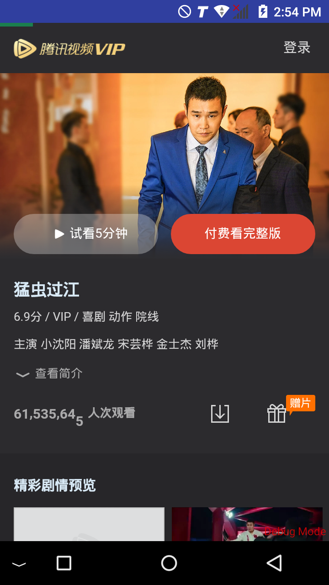
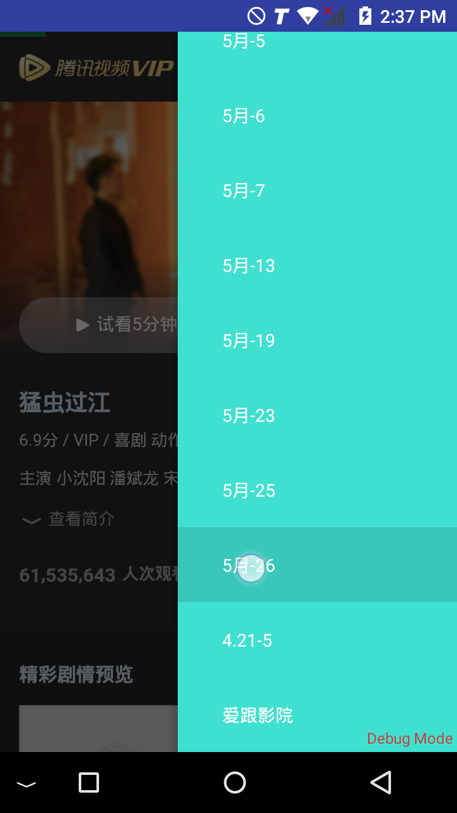
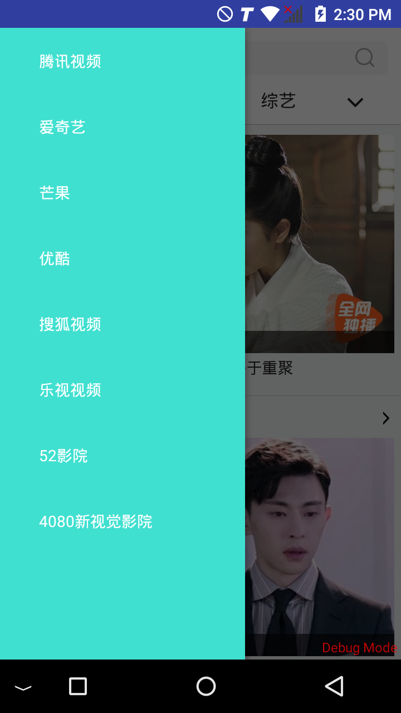

# fvip
FVIP player

#### 产品介绍

>  你不用去单独下载各个平台的客户端，只需要使用这一个客户端就能查看所有平台的视频，并且内置了各大视频网站 VIP 资源。

#### 使用方法

1. 下载客户端   
	* [Android](https://fir.im/qu73)
	* [电脑版](https://github.com/phobal/ivideo)

2. 选择视频资源  

比方说看腾讯视频上的 VIP 才能看的《猛虫过江》

点击进去以后提示需要开通VIP才能看

3. 选择资源播放接口  

 点击选择就可以播放了，如果遇到无法播放的情况，请多换几条线路试试

截图：

该项目是基于 https://github.com/phobal/ivideo 的Android打包版。

# 最后一样请大家低调使用，祝大家看得舒心
## 本项目仅作为个人学习用途，如有侵权请联系我删除该仓库
